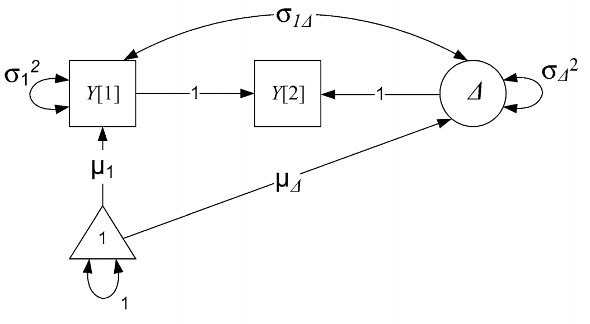

# Suggested readings

https://www.annualreviews.org/doi/abs/10.1146/annurev.psych.60.110707.163612

https://www.sciencedirect.com/science/article/pii/S187892931730021X#sec0125


# Two wave assessments

There are a lot of pre-post designs. In fact, the recent nobel prize winners have a famous paper looking at difference in difference designs, basically looking at two group pre-post tests. Collecting longitudinal data is hard, so it makes sense that a lot of this type of data will be laying around. How do we analyze it? The first thing to notice is that we jumped right into MLM this semester, bypassing simple discussions. As a result, we can only really look at change with 3 or more waves. 

How to measure change, or should we? https://www.gwern.net/docs/dnb/1970-cronbach.pdf This paper lays out some of the problems that occur with standard treatments of two wave assessments. 

The most basic two wave form of change is a difference score. However, many have said these are problematic. 
The issues are: 
1. hard to seperate measurement error from true change
2. unreliable estimate of change
3. initial level (or last level) may be driving change. How to account for? 

The second alternative is a standard residualized gain/change score where you regress time 2 onto time 1. This overcomes some of the issues raised about because we are being conservative about the error by "regressing to the mean" such that people with larger changes than average will have their change scores "shrunken" to the average, must like we do with MLMs. This also helps with accounting for starting values that may be responsible for the changes, as this is literally controlling for the initial level. 

The issues with this however are: 
1. it isn't true change, as you are implying people change similarly
2. it does not account for unreliability of change in a principled way
3. error, which should be random, is considered as change (ie residual is recharacterized) and it is likely associated with T1. 

## Lords Paradox
This has lead to what is known as Lord's paradox. Take the two approaches above, simplified to: 

`lm(t2-t1 ~ group)`
`lm(t2 ~ t1 + group)`

```{r, echo = FALSE}
set.seed(1234)
N = 200
group  = rep(c(0, 1), e=N/2)
T1 = .75*group + rnorm(N, sd=.25)
T2 = .4*T1 + .5*group + rnorm(N, sd=.1)
change = T2-T1
df = data.frame(id=factor(1:N), group=factor(group, labels=c('Tx', 'Control')), T1, T2, change)

```

```{r}
head(df)
```

change score/gain score model

```{r}

summary(lm(change ~ group, df)) 

```

residualized change score model
```{r}
summary(lm(T2 ~ group + T1, df))
```


What is going on? We are asking different questions by not accounting for T1 in the former model. The change score model is accounting for the total effect (in mediation language) whereas the residualized change score model is only interested in the direct effect. 

```{r}
library(lavaan)
library(semPlot)
mod <- '
  T1 ~ a*group
  T2 ~ b*group + c*T1
  
  # total effect
  TE := (a*-1) + (a*c*1) + (b*1)  
'
lord <- sem(mod, data=df)
summary(lord)
semPaths(lord)
```

What is not immediately obvious is that the change score can be conceptualized as a series of regressions. Starting with the residualized change score model

`T2 = b*T1 + e`

If we assume that the relationship (b) between T1 and T2 is 1. We can re-write as:

`T2 = 1*T1 + e`

Then we can subtract T1 fro each side of the model, leaving: 

`T2 - T1 = e`

In other words, a change score is equivalent to assuming a perfect regression association (correlation) between timepoints. 

Here, the residual will be equal to the average change and the variance of that will be the variance in the change. This can be thought of as akin to the mean and variance of our latent slope variable.

# common two wave models in path analysis form
Lets visualize each of these models via path models

## Residualized change model


Our latent residual can be conceptualized as what is left over from T2 after accounting for T1 (based on the average assocaition between T1 and T2). We now have a measure of error/change that is not correlated to T1. 

If we wanted to, because this is SEM, we could test this model against a no change model. What would this look like? Well we would fix $\beta_1$⁩ to zero and compare the models

```{r}
res.change <- '
  T2 ~ T1
'
res.change <- sem(res.change, data=df)
summary(res.change)

```

## Latent change score
Looping back to concerns about difference scores and residualized change scores, we can addrress these using SEM. The problems raised above go away when: 1) measureing change latently, and thus error free. 2.) seperate initial levels from change. Both of these are accomplished above. However, what is not accomplished is getting terms similar to the slope component ie a mean and a variance of a slope. 

Knowing what we know about recreating difference scores via constraints, we can also make a latent change score by modifying this path model. 



Now we can interpret the residual as change, as it is explicitly what is left over from T2 after acccoutning for T1. This is starting to look like what we have been doing recently. We have: 
1. Mean and variance of the slope(change), akin to our random and fixed effects in MLM
2. Covariance between intercept and slope. 

To test whether or not our slope is significant we can compare that with a model where slope is constrained to be zero. Same for testing the slope variance. 

```{r}
library(lavaan)
latent.change <- '
  #define difference score
  T2 ~ 1*T1
  
  # define the latent change variable
  change =~ 1*T2
  
  #estimate means
  change ~ 1
  T1 ~ 1
  
  #Constrains mean of T2 to 0
  T2 ~0*1

  #estimate variance of change
  change ~~ change

  #estimate variance of T1 intercept
  T1 ~~ T1
  
  #constrain variance of T2 to 0
  T2 ~~ 0*T2

  #intercept slope covariance
  change ~~ T1
'

latent.change <- sem(latent.change, data=df)
summary(latent.change)

```

## Residualized latent change score
Note that we havent yet removed the variance from the T1. This may or may not be something you want to do. It is mostly helpful if change has occured prior to T1 and you are looking at the impact of some variable on change. If you are doing an intervention that takes place after T1 then maybe stick to latent change model. If you are measuring a developmental process across time and wnat to make sure that intial levels aren't influencing change then you may want to do this. If you are doing that but think that initial levels are related to the change process then maybe you would be overcontrolling, wiping away what may be important. ¯\_(ツ)_/¯


```{r}
res.latent.change <- '
  #define difference score
  T2 ~ 1*T1
  
  # define the latent change variable
  change =~ 1*T2
  
  #estimate means
  change ~ 1
  T1 ~ 1
  
  #Constrains mean of T2 to 0
  T2 ~0*1

  #estimate variance of change
  change ~~ change

  #estimate variance of T1 intercept
  T1 ~~ T1
  
  #constrain variance of T2 to 0
  T2 ~~ 0*T2

  #this is the only difference
  #intercept slope regression
  change ~ T1
'

res.lat.change <- sem(res.latent.change , data=df)
summary(res.lat.change)
```


## Conditional Models

What if we want to predict initial status (or control for covariate) as well as see if change is predicted by some variable? 


```{r}
library(lavaan)
cond <- '
  #define difference score
  T2 ~ 1*T1
  
  # define the latent change variable
  change =~ 1*T2
  
  #estimate means
  change ~ 1
  T1 ~ 1
  
  #Constrains mean of T2 to 0
  T2 ~0*1

  #estimate variance of change
  change ~~ change

  #estimate variance of T1 intercept
  T1 ~~ T1
  
  #constrain variance of T2 to 0
  T2 ~~ 0*T2

  #intercept slope covariance
  change ~~ T1
  
  # predictor predicting initial status and change
  T1 ~ group
  change ~ group
  
'

cond <- sem(cond, data=df)
summary(cond)

```

Does that change regressed on group look familiar? 

This approach works the case with categorical as well as continuous predictors. 

## Multiple group models
As we have seen before, simple predictors does not allow the full range of tests on how two groups may differ. Just like before, we can specify multiple group models with this data. 


```{r}
library(lavaan)
group <- '
  #define difference score
  T2 ~ 1*T1
  
  # define the latent change variable
  change =~ 1*T2
  
  #estimate means
  change ~ 1
  T1 ~ 1
  
  #Constrains mean of T2 to 0
  T2 ~0*1

  #estimate variance of change
  change ~~ change

  #estimate variance of T1 intercept
  T1 ~~ T1
  
  #constrain variance of T2 to 0
  T2 ~~ 0*T2

  #intercept slope covariance
  change ~~ T1
  
'

group  <- sem(group, group = "group", data=df)
summary(group)

```


Compare that with a model where we constrain the slopes to be the same
```{r}
group2 <- '
  #define difference score
  T2 ~ 1*T1
  
  # define the latent change variable
  change =~ 1*T2
  
  #estimate means (here is where we constrain)
  change ~ c(s,s)*1
  T1 ~ 1
  
  #Constrains mean of T2 to 0
  T2 ~0*1

  #estimate variance of change
  change ~~ change

  #estimate variance of T1 intercept
  T1 ~~ T1
  
  #constrain variance of T2 to 0
  T2 ~~ 0*T2

  #intercept slope covariance
  change ~~ T1
  
'

group2  <- sem(group2, group = "group", data=df)
summary(group2)

```


```{r}
anova(group, group2)
```

Notice that p value from before? 

# Latent difference scores
What if we had only two time points but had latent variables? 


