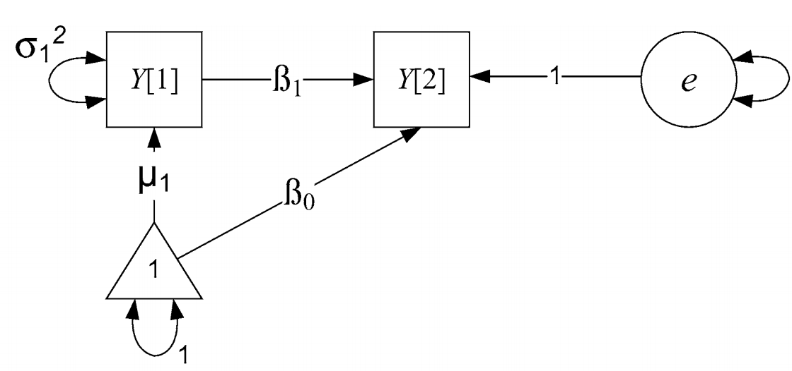
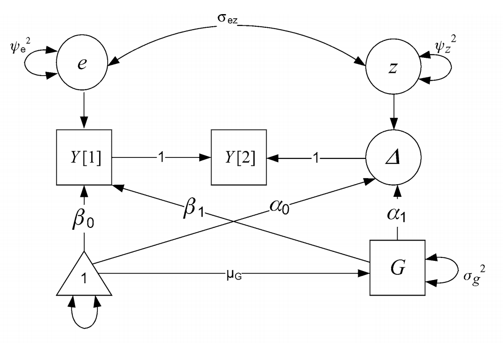

```{r setup, echo = FALSE}

knitr::opts_knit$set(root.dir = rprojroot::find_rstudio_root_file())

```

# Suggested readings

https://www.annualreviews.org/doi/abs/10.1146/annurev.psych.60.110707.163612

https://www.sciencedirect.com/science/article/pii/S187892931730021X#sec0125


# Two wave assessments

There are a lot of pre-post designs. In fact, the recent Nobel prize winners have a famous paper looking at difference in difference designs, basically looking at two group pre-post tests. Collecting longitudinal data is hard, so it makes sense that a lot of this type of data will be laying around. How do we analyze it? The first thing to notice is that we jumped right into MLM this semester, bypassing simple discussions. As a result, we can only really look at change with 3 or more waves. 

How to measure change, or should we? https://www.gwern.net/docs/dnb/1970-cronbach.pdf This paper lays out some of the problems that occur with standard treatments of two wave assessments. 

The most basic two wave form of change is a difference score. However, many have said these are problematic. 
The issues are: 
1. hard to separate measurement error from true change
2. unreliable estimate of change
3. initial level (or last level) may be driving change. How to account for? 

The second alternative is a standard residual gain/change score where you regress time 2 onto time 1. This overcomes some of the issues raised about because we are being conservative about the error by "regressing to the mean" such that people with larger changes than average will have their change scores "shrunken" to the average, must like we do with MLMs. This also helps with accounting for starting values that may be responsible for the changes, as this is literally controlling for the initial level. 

The issues with this however are: 
1. it isn't true change, as you are implying people change similarly
2. it does not account for unreliability of change in a principled way
3. error, which should be random, is considered as change (ie residual is re-characterized) and it is likely associated with T1. 

## Lords Paradox
This has lead to what is known as Lord's paradox. Take the two approaches above, simplified to: 

`lm(t2-t1 ~ group)`
`lm(t2 ~ t1 + group)`

```{r, echo = FALSE}
set.seed(1234)
N = 200
group  = rep(c(0, 1), e=N/2)
T1 = .75*group + rnorm(N, sd=.25)
T2 = .4*T1 + .5*group + rnorm(N, sd=.1)
change = T2-T1
df = data.frame(id=factor(1:N), group=factor(group, labels=c('Tx', 'Control')), T1, T2, change)

```

```{r}
head(df)
```

change score/gain score model

```{r}

summary(lm(change ~ group, df)) 

```

residualized change score model
```{r}
summary(lm(T2 ~ group + T1, df))
```


What is going on? We are asking different questions by not accounting for T1 in the former model. The change score model is accounting for the total effect (in mediation language) whereas the residualized change score model is only interested in the direct effect. 

```{r}
library(lavaan)
library(semPlot)
mod <- '
  T1 ~ a*group
  T2 ~ b*group + c*T1
  
  # total effect
  TE := (a*-1) + (a*c*1) + (b*1)  
'
lord <- sem(mod, data=df)
summary(lord)
semPaths(lord)
```

What is not immediately obvious is that the change score can be conceptualized as a series of regressions. Starting with the residualized change score model

`T2 = b*T1 + e`

If we assume that the relationship (b) between T1 and T2 is 1. We can re-write as:

`T2 = 1*T1 + e`

Then we can subtract T1 fro each side of the model, leaving: 

`T2 - T1 = e`

In other words, a change score is equivalent to assuming a perfect regression association (correlation) between timepoints. 

Here, the residual will be equal to the average change and the variance of that will be the variance in the change. This can be thought of as akin to the mean and variance of our latent slope variable.

# common two wave models in path analysis form
Lets visualize each of these models via path models

## Residualized change model





Our latent residual can be conceptualized as what is left over from T2 after accounting for T1 (based on the average association between T1 and T2). We now have a measure of error/change that is not correlated to T1. 

If we wanted to, because this is SEM, we could test this model against a no change model. What would this look like? Well we would fix $\beta_1$⁩ to zero and compare the models

```{r}
res.change <- '
  T2 ~ T1
'
res.change <- sem(res.change, data=df)
summary(res.change)

```

## Latent change score
Looping back to concerns about difference scores and residualized change scores, we can address these using SEM. The problems raised above go away when: 1) measuring change latently, and thus error free. 2.) separate initial levels from change. Both of these are accomplished above. However, what is not accomplished is getting terms similar to the slope component ie a mean and a variance of a slope. 

Knowing what we know about recreating difference scores via constraints, we can also make a latent change score by modifying this path model. 


Now we can interpret the residual as change, as it is explicitly what is left over from T2 after accoutering for T1. This is starting to look like what we have been doing recently. We have: 
1. Mean and variance of the slope(change), akin to our random and fixed effects in MLM
2. Covariance between intercept and slope. 

To test whether or not our slope is significant we can compare that with a model where slope is constrained to be zero. Same for testing the slope variance. 

```{r}
library(lavaan)
latent.change <- '
  #define difference score
  T2 ~ 1*T1
  
  # define the latent change variable
  change =~ 1*T2
  
  #estimate means
  change ~ 1
  T1 ~ 1
  
  #Constrains mean of T2 to 0
  T2 ~0*1

  #estimate variance of change
  change ~~ change

  #estimate variance of T1 intercept
  T1 ~~ T1
  
  #constrain variance of T2 to 0
  T2 ~~ 0*T2

  #intercept slope covariance
  change ~~ T1
'

latent.change <- sem(latent.change, data=df)
summary(latent.change)

```

## Residualized latent change score
Note that we haven't yet removed the variance from the T1. This may or may not be something you want to do. It is mostly helpful if change has occurred prior to T1 and you are looking at the impact of some variable on change. If you are doing an intervention that takes place after T1 then maybe stick to latent change model. If you are measuring a developmental process across time and want to make sure that initial levels aren't influencing change then you may want to do this. If you are doing that but think that initial levels are related to the change process then maybe you would be over controlling, wiping away what may be important. ¯\_(ツ)_/¯


```{r}
res.latent.change <- '
  #define difference score
  T2 ~ 1*T1
  
  # define the latent change variable
  change =~ 1*T2
  
  #estimate means
  change ~ 1
  T1 ~ 1
  
  #Constrains mean of T2 to 0
  T2 ~0*1

  #estimate variance of change
  change ~~ change

  #estimate variance of T1 intercept
  T1 ~~ T1
  
  #constrain variance of T2 to 0
  T2 ~~ 0*T2

  #this is the only difference
  #intercept slope regression
  change ~ T1
'

res.lat.change <- sem(res.latent.change , data=df)
summary(res.lat.change)
```


## Conditional Models

What if we want to predict initial status (or control for covariate) as well as see if change is predicted by some variable? 



```{r}
library(lavaan)
cond <- '
  #define difference score
  T2 ~ 1*T1
  
  # define the latent change variable
  change =~ 1*T2
  
  #estimate means
  change ~ 1
  T1 ~ 1
  
  #Constrains mean of T2 to 0
  T2 ~0*1

  #estimate variance of change
  change ~~ change

  #estimate variance of T1 intercept
  T1 ~~ T1
  
  #constrain variance of T2 to 0
  T2 ~~ 0*T2

  #intercept slope covariance
  change ~~ T1
  
  # predictor predicting initial status and change
  T1 ~ group
  change ~ group
  
'

cond <- sem(cond, data=df)
summary(cond)

```

Does that change regressed on group look familiar? 

This approach works the case with categorical as well as continuous predictors. 

## Multiple group models
As we have seen before, simple predictors does not allow the full range of tests on how two groups may differ. Just like before, we can specify multiple group models with this data. 


```{r}
library(lavaan)
group <- '
  #define difference score
  T2 ~ 1*T1
  
  # define the latent change variable
  change =~ 1*T2
  
  #estimate means
  change ~ 1
  T1 ~ 1
  
  #Constrains mean of T2 to 0
  T2 ~0*1

  #estimate variance of change
  change ~~ change

  #estimate variance of T1 intercept
  T1 ~~ T1
  
  #constrain variance of T2 to 0
  T2 ~~ 0*T2

  #intercept slope covariance
  change ~~ T1
  
'

group  <- sem(group, group = "group", data=df)
summary(group)

```


Compare that with a model where we constrain the slopes to be the same
```{r}
group2 <- '
  #define difference score
  T2 ~ 1*T1
  
  # define the latent change variable
  change =~ 1*T2
  
  #estimate means (here is where we constrain)
  change ~ c(s,s)*1
  T1 ~ 1
  
  #Constrains mean of T2 to 0
  T2 ~0*1

  #estimate variance of change
  change ~~ change

  #estimate variance of T1 intercept
  T1 ~~ T1
  
  #constrain variance of T2 to 0
  T2 ~~ 0*T2

  #intercept slope covariance
  change ~~ T1
  
'

group2  <- sem(group2, group = "group", data=df)
summary(group2)

```


```{r}
anova(group, group2)
```

Notice that p value from before? 


## Bi-variate latent change model

Similar to the bivariate latent grown model, this is helpful if we want to ask whether or not two variables change in tandem. 


```{r}
long <- read.csv("~/Box/5165 Applied Longitudinal Data Analysis/SEM_workshop/longitudinal.csv")

bv.lcm <- '
  #define difference score
  PosAFF12 ~ 1*PosAFF11
  
  # define the latent change variable
  change.pa =~ 1*PosAFF12
  
  #estimate means
  change.pa ~ 1
  PosAFF11 ~ 1
  
  #Constrains mean of T2 to 0
  PosAFF12 ~0*1

  #estimate variance of change
  change.pa ~~ change.pa

  #estimate variance of T1 intercept
  PosAFF11 ~~ PosAFF11
  
  #constrain variance of T2 to 0
  PosAFF12 ~~ 0*PosAFF12

  #intercept slope covariance
  change.pa ~~ PosAFF11

  ## second process
  
   #define difference score
  NegAFF12 ~ 1*NegAFF11
  
  # define the latent change variable
  change.na =~ 1*NegAFF12
  
  #estimate means
  change.na ~ 1
  NegAFF11 ~ 1
  
  #Constrains mean of T2 to 0
  NegAFF12 ~0*1

  #estimate variance of change
  change.na ~~ change.na

  #estimate variance of T1 intercept
  NegAFF11 ~~ NegAFF11
  
  #constrain variance of T2 to 0
  NegAFF12 ~~ 0*NegAFF12

  #intercept slope covariance
  change.na ~~ NegAFF11
  
  
  ## look at the covariance between change and intercept parameters
  
  change.na ~~ change.pa

  NegAFF11 ~~ PosAFF11
  
'

bv.lcm <- sem(bv.lcm, data=long)
summary(bv.lcm)

```

```{r}
semPaths(bv.lcm)
```


# Latent difference/change score model
What if we had only two time points but had latent variables? This is where the model really starts to shine as we are better able to overcome some of the negatives of difference scores -- namely that they are error filled. Here we will be measuring the variables latently to reduce error and constraining the measurement so that the assumption of measurement invariance holds. 

```{r, echo=FALSE}
#####  Simulate data for a multiple indicator Univariate Latent Change Score model ####
#Fix sample size
samplesize<-500

#Simulate data for a Univariate Latent Change Score model. 
MILCS_simulate<-'

####    The following two lines specify the measurement model for multiple indicators (X1-X3) 
####    measured on two occasions (T1-T2)
C_T1=~.8*T1X1+.9*T1X2+.7*T1X3   # This specifies the measurement model for C_T1 
C_T2=~.8*T2X1+.9*T2X2+.7*T2X3   # This specifies the measurement model for C_T2 


#####     The following lines specify the core assumptions of the LCS 
#####     and should not generally be modified

C_T2 ~ 1*C_T1           # Fixed regression of C_T2 on C_T1
change_C =~ 1*C_T2           # Fixed regression of change_C on C_T2
C_T2 ~ 0*1                # This line constrains the intercept of C_T2 to 0
C_T2 ~~ 0*C_T2          # This fixes the variance of the C_T2 to 0  


T1X1~0*1                  # This fixes the intercept of X1 to 0
T1X2~0*1                  # This fixes the intercept of X2 to 1
T1X3~.0*1                 # This fixes the intercept of X3 to 0.5 
T2X1~0*1                  # This fixes the intercept of X1 to 0
T2X2~0*1                  # This fixes the intercept of X2 to 1
T2X3~0*1                 # This fixes the intercept of X3 to 0.5


###### The following five parameters will be estimated in the model. 
###### Values can be modified manually to examine the effect on the model

change_C ~ 1.5*1            # This fixes the intercept of the change score to 3 
C_T1 ~ 6*1           # This fixes the intercept of COG_T1 to 50. 
change_C ~~ .75*change_C        # This fixes the variance of the change scores to .75. 
C_T1 ~~ 1.3*C_T1      # This fixes the variance of the COG_T1 to 8. 
change_C~-0.1*C_T1       # This fixes the self-feedback parameter to -0.1. 
'

#Simulate data
set.seed(1234)
simdat<-simulateData(MILCS_simulate,sample.nobs = samplesize,meanstructure = T) #Simulate data
colMeans(simdat) #sanity check the means
write.csv(simdat,'2_simdat.csv')
library(tidyverse)
simdat <- as_tibble(simdat)
```

```{r}
change <-

#setup is similar to standard latent difference except that we will not use latent variables as our repeated measures. 
  
'C_T1=~1*T1X1 + L2*T1X2  + L3*T1X3    
C_T2=~1*T2X1 + L2*T2X2 + L3*T2X3   

C_T2 ~ 1*C_T1     # Fixed regression of C_T2 on C_T1
change_C =~ 1*C_T2     # Fixed regression of dC on C_T2
C_T2 ~ 0*1        # This line constrains the intercept of C_T2 to 0
C_T2 ~~ 0*C_T2    # This fixes the variance of the C_T2 to 0 

change_C ~ 1             # This estimates the intercept of the change score 
C_T1 ~  1           # This estimates the intercept of C_T1 
change_C ~~  change_C       # This estimates the variance of the change scores 
C_T1 ~~ C_T1     # This estimates the variance of the C_T1 
change_C ~~ C_T1 # This estimates the self-feedback parameter, which for now is just the covaration with change and T1

## new compared to no latent repeated measures
T1X1~~T2X1   # This allows residual covariance on indicator X1 across T1 and T2
T1X2~~T2X2   # This allows residual covariance on indicator X2 across T1 and T2
T1X3~~T2X3   # This allows residual covariance on indicator X3 across T1 and T2

T1X1~~T1X1   # This allows residual variance on indicator X1 
T1X2~~T1X2   # This allows residual variance on indicator X2
T1X3~~T1X3   # This allows residual variance on indicator X3

T2X1~~T2X1  # This allows residual variance on indicator X1 at T2 
T2X2~~T2X2  # This allows residual variance on indicator X2 at T2 
T2X3~~T2X3  # This allows residual variance on indicator X3 at T2


#scales the items
T1X1~0*1    # This constrains the intercept of X1 to 0 at T1
T1X2~M2*1   # This estimates the intercept of X2 at T1
T1X3~M3*1   # This estimates the intercept of X3 at T1
T2X1~0*1    # This constrains the intercept of X1 to 0 at T2
T2X2~M2*1   # This estimates the intercept of X2 at T2
T2X3~M3*1   # This estimates the intercept of X3 at T2

'

change.fit <- sem(change, data=simdat, missing="ML")
summary(change.fit, fit.measures=TRUE, standardized=TRUE, rsquare=TRUE)
```

```{r}
semPaths(change.fit )
```

Same as before, we can run multiple groups analyses, introduce covariates/predictors, regress change onto time 1 and look at bi-variate processes simultanously. 


# Multiple wave Latent Difference Score model (LDS)

What is especially nice is that we can extend the model into more than 2 waves. This is a rethinking of how to assess 3+ waves of data. As opposed to thinking of a standard growth process that is unchanging, this instead reconceptualizing the change as a set of difference scores. You can increase, then decrease, then increase, for example. There is flexibility in this approach. First, you can get more precise assessments of when change is occuring. If you are measuring grades 5-12 with some event predictor maybe the change only occured during grades 6-7. How would you test that in a standard growth model? Second, you can model more non-linear associations with parameters that are easier to interpret than quadratics and higher order terms. 

However there is also downsides. First, there are more parameters to estimate. More parameters mean a more difficult time in estimating the model. So it is possible that you have not as accurate (mean est) and not as precise (larger SEs) compared to a more simplistic model like a growth model. Second, there are increased analytic choices which could lead to confusing, p-hacking and all around disillusion on what is the correct model. For example, do you model all change paramters to have similar covariances across time? Do you constrain variance to be the same and allow the means to differ -- or vice versa? Do you impose MI? 

```{r}
y_t_all <- read.csv("~/Box/5165 Applied Longitudinal Data Analysis/ALDA/combined_models.csv")
```

```{r}
mw.model <-
'e7 =~ 1*TPER7_01 + cat6*TPER7_04 + cat2*TPER7_15 + cat3*TPER7_19R + cat4*TPER7_22R
e8 =~ 1*TPER8_01 + cat6*TPER8_04 + cat2*TPER8_15 + cat3*TPER8_19R + cat4*TPER8_22R
e9 =~ 1*TPER9_01 + cat6*TPER9_04 + cat2*TPER9_15 + cat3*TPER9_19R + cat4*TPER9_22R
e10 =~ 1*TPER10_01 + cat6*TPER10_04 + cat2*TPER10_15 + cat3*TPER10_19R + cat4*TPER10_22R


# settting the fixed regressions to 1

e8 ~ 1*e7     
e9 ~ 1*e8  
e10 ~ 1*e9  

# creating the change scores 

c_7.8 =~ 1*e8     
c_8.9 =~ 1*e9 
c_9.10 =~ 1*e10 


# constraint intercepts
e8 ~ 0*1        
e9 ~ 0*1   
e10 ~ 0*1   

# This fixes the variance to 0

e8 ~~ 0*e8     
e9 ~~ 0*e9  
e10 ~~ 0*e10  

# Estimate the intercept of the change score
c_7.8 ~ 1    
c_8.9 ~ 1 
c_9.10 ~ 1             

# This estimates the intercept and variance of initial time
e7 ~  1           
e7 ~~  e7 

#  Estimates the variance of the change scores
c_7.8 ~~ c_7.8    
c_8.9 ~~ c_8.9 
c_9.10 ~~ c_9.10       


# Estimates the covaration with change scores and T1
e7  ~~ c_7.8 + c_8.9 + c_9.10 
c_7.8 ~~ c_8.9 + c_9.10
c_8.9 ~~ c_9.10

## Allow indicators to covary
TPER7_01 ~~ TPER8_01 + TPER9_01 + TPER10_01
TPER8_01 ~~ TPER9_01 + TPER10_01
TPER9_01 ~~ TPER10_01

TPER7_04 ~~ TPER8_04 + TPER9_04 + TPER10_04
TPER8_04 ~~ TPER9_04 + TPER10_04
TPER9_04 ~~ TPER10_04

TPER7_15 ~~ TPER8_15 + TPER9_15 + TPER10_15
TPER8_15 ~~ TPER9_15 + TPER10_15
TPER9_15 ~~ TPER10_15

TPER7_19R ~~ TPER8_19R + TPER9_19R + TPER10_19R
TPER8_19R ~~ TPER9_19R + TPER10_19R
TPER9_19R ~~ TPER10_19R

TPER7_22R ~~ TPER8_22R + TPER9_22R + TPER10_22R
TPER8_22R ~~ TPER9_22R + TPER10_22R
TPER9_22R ~~ TPER10_22R


#scales the items and add measurement invariance

TPER7_01 ~ 0*1
TPER7_04 ~ (nu1)*1
TPER7_15 ~ (nu2)*1
TPER7_19R ~ (nu3)*1
TPER7_22R ~ (nu4)*1

TPER8_01~ 0*1
TPER8_04 ~ (nu1)*1
TPER8_15~ (nu2)*1
TPER8_19R ~ (nu3)*1
TPER8_22R~ (nu4)*1

TPER9_01~ 0*1
TPER9_04 ~ (nu1)*1
TPER9_15~ (nu2)*1
TPER9_19R ~ (nu3)*1
TPER9_22R~ (nu4)*1

TPER10_01 ~ 0*1
TPER10_04 ~ (nu1)*1
TPER10_15 ~ (nu2)*1
TPER10_19R ~ (nu3)*1
TPER10_22R ~ (nu4)*1

'

mw.model <- sem(mw.model, data=y_t_all , missing="ML")
summary(mw.model, fit.measures=TRUE, standardized=TRUE)

```

```{r}
semPaths(mw.model)
```
Gross. We have to draw this by hand to get a good representation. 

## predicting change

```{r}

c.mw.model <-
'e7 =~ 1*TPER7_01 + cat6*TPER7_04 + cat2*TPER7_15 + cat3*TPER7_19R + cat4*TPER7_22R
e8 =~ 1*TPER8_01 + cat6*TPER8_04 + cat2*TPER8_15 + cat3*TPER8_19R + cat4*TPER8_22R
e9 =~ 1*TPER9_01 + cat6*TPER9_04 + cat2*TPER9_15 + cat3*TPER9_19R + cat4*TPER9_22R
e10 =~ 1*TPER10_01 + cat6*TPER10_04 + cat2*TPER10_15 + cat3*TPER10_19R + cat4*TPER10_22R


# settting the fixed regressions to 1

e8 ~ 1*e7     
e9 ~ 1*e8  
e10 ~ 1*e9  

# creating the change scores 

c_7.8 =~ 1*e8     
c_8.9 =~ 1*e9 
c_9.10 =~ 1*e10 


# constraint intercepts
e8 ~ 0*1        
e9 ~ 0*1   
e10 ~ 0*1   

# This fixes the variance to 0

e8 ~~ 0*e8     
e9 ~~ 0*e9  
e10 ~~ 0*e10  

# Estimate the intercept of the change score
c_7.8 ~ 1    
c_8.9 ~ 1 
c_9.10 ~ 1             

# This estimates the intercept and variance of initial time
e7 ~  1           
e7 ~~  e7 

#  Estimates the variance of the change scores
c_7.8 ~~ c_7.8    
c_8.9 ~~ c_8.9 
c_9.10 ~~ c_9.10       


# Estimates the covaration with change scores and T1
e7  ~~ c_7.8 + c_8.9 + c_9.10 
c_7.8 ~~ c_8.9 + c_9.10
c_8.9 ~~ c_9.10

## Allow indicators to covary
TPER7_01 ~~ TPER8_01 + TPER9_01 + TPER10_01
TPER8_01 ~~ TPER9_01 + TPER10_01
TPER9_01 ~~ TPER10_01

TPER7_04 ~~ TPER8_04 + TPER9_04 + TPER10_04
TPER8_04 ~~ TPER9_04 + TPER10_04
TPER9_04 ~~ TPER10_04

TPER7_15 ~~ TPER8_15 + TPER9_15 + TPER10_15
TPER8_15 ~~ TPER9_15 + TPER10_15
TPER9_15 ~~ TPER10_15

TPER7_19R ~~ TPER8_19R + TPER9_19R + TPER10_19R
TPER8_19R ~~ TPER9_19R + TPER10_19R
TPER9_19R ~~ TPER10_19R

TPER7_22R ~~ TPER8_22R + TPER9_22R + TPER10_22R
TPER8_22R ~~ TPER9_22R + TPER10_22R
TPER9_22R ~~ TPER10_22R


#scales the items and add measurement invariance

TPER7_01 ~ 0*1
TPER7_04 ~ (nu1)*1
TPER7_15 ~ (nu2)*1
TPER7_19R ~ (nu3)*1
TPER7_22R ~ (nu4)*1

TPER8_01~ 0*1
TPER8_04 ~ (nu1)*1
TPER8_15~ (nu2)*1
TPER8_19R ~ (nu3)*1
TPER8_22R~ (nu4)*1

TPER9_01~ 0*1
TPER9_04 ~ (nu1)*1
TPER9_15~ (nu2)*1
TPER9_19R ~ (nu3)*1
TPER9_22R~ (nu4)*1

TPER10_01 ~ 0*1
TPER10_04 ~ (nu1)*1
TPER10_15 ~ (nu2)*1
TPER10_19R ~ (nu3)*1
TPER10_22R ~ (nu4)*1

# predicting change

c_7.8 ~ SEX1    
c_8.9 ~ SEX1 
c_9.10 ~ SEX1 


'

c.mw.model <- sem(c.mw.model, data=y_t_all , missing="ML")
summary(c.mw.model, fit.measures=TRUE, standardized=TRUE)

```


## adding intercept and growth factors to LDS models

One top of this type of model you can fit a growth curve. Why?  Can capture both general trends and more fine-grained temporal dynamics. This can be especially useful when trying to separate a known, more stable change occurring during development (e.g.natural aging process) from more specific fluctuations due to external factors (e.g., life events).

However, there are some differences from our standard latent growth model. First, if the difference scores are equal across time the mean of the change factor will be 0. This is because the latent change variable are using difference scores as indicators, not standard indicators. As such, this can be interpreted as a constant rate of change (or not). 

If you want to get at a standard interpretation of a growth curve, seperate from change at a specific time point, you can define the change score with loadings of 1 for all difference score variables as opposed to increasing linearly eg 1,2,3,4,5...

```{r}
lg.mw.model <-
'e7 =~ 1*TPER7_01 + cat6*TPER7_04 + cat2*TPER7_15 + cat3*TPER7_19R + cat4*TPER7_22R
e8 =~ 1*TPER8_01 + cat6*TPER8_04 + cat2*TPER8_15 + cat3*TPER8_19R + cat4*TPER8_22R
e9 =~ 1*TPER9_01 + cat6*TPER9_04 + cat2*TPER9_15 + cat3*TPER9_19R + cat4*TPER9_22R
e10 =~ 1*TPER10_01 + cat6*TPER10_04 + cat2*TPER10_15 + cat3*TPER10_19R + cat4*TPER10_22R


# settting the fixed regressions to 1

e8 ~ 1*e7     
e9 ~ 1*e8  
e10 ~ 1*e9  

# creating the change scores 

c_7.8 =~ 1*e8     
c_8.9 =~ 1*e9 
c_9.10 =~ 1*e10 


# constraint intercepts
e8 ~ 0*1        
e9 ~ 0*1   
e10 ~ 0*1   

# This fixes the variance to 0

e8 ~~ 0*e8     
e9 ~~ 0*e9  
e10 ~~ 0*e10  

# # a change from the previous models is we now fix the mean of change scores to zero. Estimate the intercept of the change score
c_7.8 ~ 0*1    
c_8.9 ~ 0*1 
c_9.10 ~ 0*1             

# This estimates the intercept and variance of initial time
e7 ~  1           
e7 ~~  e7 

#  Estimates the variance of the change scores
c_7.8 ~~ c_7.8    
c_8.9 ~~ c_8.9 
c_9.10 ~~ c_9.10       


# # A change from the previous model is we no longer estimate the covariance between change scores a) with eachother and b) with the intercept. We will only covary intercept with a growth component, defined below. We must set some of these covariances to zero to make sure they are not estimated.  
e7  ~~ 0*c_7.8 + 0*c_8.9 + 0*c_9.10
c_7.8 ~~ 0*c_8.9 + 0*c_9.10
c_8.9 ~~ 0*c_9.10


## Allow indicators to covary
TPER7_01 ~~ TPER8_01 + TPER9_01 + TPER10_01
TPER8_01 ~~ TPER9_01 + TPER10_01
TPER9_01 ~~ TPER10_01

TPER7_04 ~~ TPER8_04 + TPER9_04 + TPER10_04
TPER8_04 ~~ TPER9_04 + TPER10_04
TPER9_04 ~~ TPER10_04

TPER7_15 ~~ TPER8_15 + TPER9_15 + TPER10_15
TPER8_15 ~~ TPER9_15 + TPER10_15
TPER9_15 ~~ TPER10_15

TPER7_19R ~~ TPER8_19R + TPER9_19R + TPER10_19R
TPER8_19R ~~ TPER9_19R + TPER10_19R
TPER9_19R ~~ TPER10_19R

TPER7_22R ~~ TPER8_22R + TPER9_22R + TPER10_22R
TPER8_22R ~~ TPER9_22R + TPER10_22R
TPER9_22R ~~ TPER10_22R


#scales the items and add measurement invariance

TPER7_01 ~ 0*1
TPER7_04 ~ (nu1)*1
TPER7_15 ~ (nu2)*1
TPER7_19R ~ (nu3)*1
TPER7_22R ~ (nu4)*1

TPER8_01~ 0*1
TPER8_04 ~ (nu1)*1
TPER8_15~ (nu2)*1
TPER8_19R ~ (nu3)*1
TPER8_22R~ (nu4)*1

TPER9_01~ 0*1
TPER9_04 ~ (nu1)*1
TPER9_15~ (nu2)*1
TPER9_19R ~ (nu3)*1
TPER9_22R~ (nu4)*1

TPER10_01 ~ 0*1
TPER10_04 ~ (nu1)*1
TPER10_15 ~ (nu2)*1
TPER10_19R ~ (nu3)*1
TPER10_22R ~ (nu4)*1

# create a latent intercept growth component
E.change  =~ 1*e8 + 2*e9 + 3*e10
E.change ~ 1

# Covary the intecept and new overall change component and make sure change does not covary with difference scores
E.change ~~ e7
E.change ~~ 0*c_7.8 + 0*c_8.9 + 0*c_9.10

'

lg.mw.model <- sem(lg.mw.model, data=y_t_all , missing="ML")
summary(lg.mw.model, fit.measures=TRUE)

```

Now lets try this same model but with equal loadings on our general change factor. 
```{r}
e.lg.mw.model <-
'e7 =~ 1*TPER7_01 + cat6*TPER7_04 + cat2*TPER7_15 + cat3*TPER7_19R + cat4*TPER7_22R
e8 =~ 1*TPER8_01 + cat6*TPER8_04 + cat2*TPER8_15 + cat3*TPER8_19R + cat4*TPER8_22R
e9 =~ 1*TPER9_01 + cat6*TPER9_04 + cat2*TPER9_15 + cat3*TPER9_19R + cat4*TPER9_22R
e10 =~ 1*TPER10_01 + cat6*TPER10_04 + cat2*TPER10_15 + cat3*TPER10_19R + cat4*TPER10_22R


# settting the fixed regressions to 1

e8 ~ 1*e7     
e9 ~ 1*e8  
e10 ~ 1*e9  

# creating the change scores 

c_7.8 =~ 1*e8     
c_8.9 =~ 1*e9 
c_9.10 =~ 1*e10 


# constraint intercepts
e8 ~ 0*1        
e9 ~ 0*1   
e10 ~ 0*1   

# This fixes the variance to 0

e8 ~~ 0*e8     
e9 ~~ 0*e9  
e10 ~~ 0*e10  

# Estimate the intercept of the change scores
c_7.8 ~ 0*1    
c_8.9 ~ 0*1 
c_9.10 ~ 0*1             

# This estimates the intercept and variance of initial time
e7 ~  1           
e7 ~~  e7 

#  Estimates the variance of the change scores
c_7.8 ~~ c_7.8    
c_8.9 ~~ c_8.9 
c_9.10 ~~ c_9.10       


# # A change from the previous model is we no longer estimate the covariance between change scores a) with eachother and b) with the intercept. We will only covary intercept with a growth component, defined below. We must set some of these covariances to zero to make sure they are not estimated.  
e7  ~~ 0*c_7.8 + 0*c_8.9 + 0*c_9.10
c_7.8 ~~ 0*c_8.9 + 0*c_9.10
c_8.9 ~~ 0*c_9.10


## Allow indicators to covary
TPER7_01 ~~ TPER8_01 + TPER9_01 + TPER10_01
TPER8_01 ~~ TPER9_01 + TPER10_01
TPER9_01 ~~ TPER10_01

TPER7_04 ~~ TPER8_04 + TPER9_04 + TPER10_04
TPER8_04 ~~ TPER9_04 + TPER10_04
TPER9_04 ~~ TPER10_04

TPER7_15 ~~ TPER8_15 + TPER9_15 + TPER10_15
TPER8_15 ~~ TPER9_15 + TPER10_15
TPER9_15 ~~ TPER10_15

TPER7_19R ~~ TPER8_19R + TPER9_19R + TPER10_19R
TPER8_19R ~~ TPER9_19R + TPER10_19R
TPER9_19R ~~ TPER10_19R

TPER7_22R ~~ TPER8_22R + TPER9_22R + TPER10_22R
TPER8_22R ~~ TPER9_22R + TPER10_22R
TPER9_22R ~~ TPER10_22R


#scales the items and add measurement invariance

TPER7_01 ~ 0*1
TPER7_04 ~ (nu1)*1
TPER7_15 ~ (nu2)*1
TPER7_19R ~ (nu3)*1
TPER7_22R ~ (nu4)*1

TPER8_01~ 0*1
TPER8_04 ~ (nu1)*1
TPER8_15~ (nu2)*1
TPER8_19R ~ (nu3)*1
TPER8_22R~ (nu4)*1

TPER9_01~ 0*1
TPER9_04 ~ (nu1)*1
TPER9_15~ (nu2)*1
TPER9_19R ~ (nu3)*1
TPER9_22R~ (nu4)*1

TPER10_01 ~ 0*1
TPER10_04 ~ (nu1)*1
TPER10_15 ~ (nu2)*1
TPER10_19R ~ (nu3)*1
TPER10_22R ~ (nu4)*1

# create a latent intercept growth component
E.change  =~ 1*e8 + 1*e9 + 1*e10
E.change ~ 1

# Covary the intecept and new overall change component and make sure change does not covary with difference scores
E.change ~~ e7
E.change ~~ 0*c_7.8 + 0*c_8.9 + 0*c_9.10

'

e.lg.mw.model <- sem(e.lg.mw.model, data=y_t_all , missing="ML")
summary(e.lg.mw.model, fit.measures=TRUE)

```

What does the negative variance here mean? 


## "steyer" models

Similar to the above models but are addative in their interpretation. That is, the difference score between waves can be thought of adding or subtracting cumulatively from the previous wave. This is a closer hybrid between the growth model and the latent difference score model as the final difference score estimate is interpretted as across the entire time period. 


```{r}
model <-
'extra7 =~ 1*TPER7_01 + cat6*TPER7_04 + cat2*TPER7_15 + cat3*TPER7_19R + cat4*TPER7_22R
extra8 =~ 1*TPER8_01 + cat6*TPER8_04 + cat2*TPER8_15 + cat3*TPER8_19R + cat4*TPER8_22R
extra9 =~ 1*TPER9_01 + cat6*TPER9_04 + cat2*TPER9_15 + cat3*TPER9_19R + cat4*TPER9_22R
extra10 =~ 1*TPER10_01 + cat6*TPER10_04 + cat2*TPER10_15 + cat3*TPER10_19R + cat4*TPER10_22R

TPER7_01 ~ 0*1
TPER7_04 ~ (nu1)*1
TPER7_15 ~ (nu2)*1
TPER7_19R ~ (nu3)*1
TPER7_22R ~ (nu4)*1

TPER8_01~ 0*1
TPER8_04 ~ (nu1)*1
TPER8_15~ (nu2)*1
TPER8_19R ~ (nu3)*1
TPER8_22R~ (nu4)*1

TPER9_01~ 0*1
TPER9_04 ~ (nu1)*1
TPER9_15~ (nu2)*1
TPER9_19R ~ (nu3)*1
TPER9_22R~ (nu4)*1

TPER10_01 ~ 0*1
TPER10_04 ~ (nu1)*1
TPER10_15 ~ (nu2)*1
TPER10_19R ~ (nu3)*1
TPER10_22R ~ (nu4)*1

TPER7_01 ~~ TPER8_01 + TPER9_01 + TPER10_01
TPER8_01 ~~ TPER9_01 + TPER10_01
TPER9_01 ~~ TPER10_01

TPER7_04 ~~ TPER8_04 + TPER9_04 + TPER10_04
TPER8_04 ~~ TPER9_04 + TPER10_04
TPER9_04 ~~ TPER10_04

TPER7_15 ~~ TPER8_15 + TPER9_15 + TPER10_15
TPER8_15 ~~ TPER9_15 + TPER10_15
TPER9_15 ~~ TPER10_15

TPER7_19R ~~ TPER8_19R + TPER9_19R + TPER10_19R
TPER8_19R ~~ TPER9_19R + TPER10_19R
TPER9_19R ~~ TPER10_19R

TPER7_22R ~~ TPER8_22R + TPER9_22R + TPER10_22R
TPER8_22R ~~ TPER9_22R + TPER10_22R
TPER9_22R ~~ TPER10_22R

extra7 ~ 0*1
extra8 ~ 0*1
extra9 ~ 0*1
extra10 ~ 0*1

extra7 ~~ 0*extra7
extra8 ~~ 0*extra8
extra9 ~~ 0*extra9
extra10 ~~ 0*extra10

t7 =~ 1*extra7 + 1*extra8 + 1*extra9 + 1*extra10
t7 ~ 1
t7 ~~ t7

d8 =~ 1*extra8
d8 ~~ d8
d8 ~ 1

d9 =~ 1*extra9
d9 ~~ d9
d9 ~ 1

d10 =~ 1*extra10
d10 ~~ d10
d10 ~ 1

t7 ~~ d8 + d9 + d10
d8 ~~ d9 + d10
d9 ~~ d10'

fitE_t <- sem(model, missing="ML", data = y_t_all)
summary(fitE_t)
```

Compare the means here with the means of the original latent difference score model. 

## adding time varying covariates

The tricky tricky part is interpretation. It is also possible to constraint the effect of the TVC to be the same across time. 

```{r}

tvc.mw.model <-
'e7 =~ 1*TPER7_01 + cat6*TPER7_04 + cat2*TPER7_15 + cat3*TPER7_19R + cat4*TPER7_22R
e8 =~ 1*TPER8_01 + cat6*TPER8_04 + cat2*TPER8_15 + cat3*TPER8_19R + cat4*TPER8_22R
e9 =~ 1*TPER9_01 + cat6*TPER9_04 + cat2*TPER9_15 + cat3*TPER9_19R + cat4*TPER9_22R
e10 =~ 1*TPER10_01 + cat6*TPER10_04 + cat2*TPER10_15 + cat3*TPER10_19R + cat4*TPER10_22R


# settting the fixed regressions to 1

e8 ~ 1*e7     
e9 ~ 1*e8  
e10 ~ 1*e9  

# creating the change scores 

c_7.8 =~ 1*e8     
c_8.9 =~ 1*e9 
c_9.10 =~ 1*e10 


# constraint intercepts
e8 ~ 0*1        
e9 ~ 0*1   
e10 ~ 0*1   

# This fixes the variance to 0

e8 ~~ 0*e8     
e9 ~~ 0*e9  
e10 ~~ 0*e10  

# Estimate the intercept of the change score
c_7.8 ~ 1    
c_8.9 ~ 1 
c_9.10 ~ 1             

# This estimates the intercept and variance of initial time
e7 ~  1           
e7 ~~  e7 

#  Estimates the variance of the change scores
c_7.8 ~~ c_7.8    
c_8.9 ~~ c_8.9 
c_9.10 ~~ c_9.10       


# Estimates the covaration with change scores and T1
e7  ~~ c_7.8 + c_8.9 + c_9.10 
c_7.8 ~~ c_8.9 + c_9.10
c_8.9 ~~ c_9.10

## Allow indicators to covary
TPER7_01 ~~ TPER8_01 + TPER9_01 + TPER10_01
TPER8_01 ~~ TPER9_01 + TPER10_01
TPER9_01 ~~ TPER10_01

TPER7_04 ~~ TPER8_04 + TPER9_04 + TPER10_04
TPER8_04 ~~ TPER9_04 + TPER10_04
TPER9_04 ~~ TPER10_04

TPER7_15 ~~ TPER8_15 + TPER9_15 + TPER10_15
TPER8_15 ~~ TPER9_15 + TPER10_15
TPER9_15 ~~ TPER10_15

TPER7_19R ~~ TPER8_19R + TPER9_19R + TPER10_19R
TPER8_19R ~~ TPER9_19R + TPER10_19R
TPER9_19R ~~ TPER10_19R

TPER7_22R ~~ TPER8_22R + TPER9_22R + TPER10_22R
TPER8_22R ~~ TPER9_22R + TPER10_22R
TPER9_22R ~~ TPER10_22R


#scales the items and add measurement invariance

TPER7_01 ~ 0*1
TPER7_04 ~ (nu1)*1
TPER7_15 ~ (nu2)*1
TPER7_19R ~ (nu3)*1
TPER7_22R ~ (nu4)*1

TPER8_01~ 0*1
TPER8_04 ~ (nu1)*1
TPER8_15~ (nu2)*1
TPER8_19R ~ (nu3)*1
TPER8_22R~ (nu4)*1

TPER9_01~ 0*1
TPER9_04 ~ (nu1)*1
TPER9_15~ (nu2)*1
TPER9_19R ~ (nu3)*1
TPER9_22R~ (nu4)*1

TPER10_01 ~ 0*1
TPER10_04 ~ (nu1)*1
TPER10_15 ~ (nu2)*1
TPER10_19R ~ (nu3)*1
TPER10_22R ~ (nu4)*1

# predicting change
# Note: Technically the covariate model above is set up the same way.  

c_7.8 ~  ALC8_01   
c_8.9 ~  ALC9_01
c_9.10 ~ ALC10_01


'

tvc.mw.model <- sem(tvc.mw.model, data=y_t_all , missing="ML")
summary(tvc.mw.model, fit.measures=TRUE, standardized=TRUE)

y_t_all$alc

```


# Latent Duel change score model (like a residualized latent change score)

The regression from t-1 to change at t can also be introduced into these models. It will have a new name: self-feedback. It is akin to our standard intercept-change correlation where it may be those who start higher change more (or less). This parameter will become important when we start to examine bivariate models. It is called duel because there are two components: the rate of change (slope) and the self-feedback. 

```{r}
duel.model <-
'e7 =~ 1*TPER7_01 + cat6*TPER7_04 + cat2*TPER7_15 + cat3*TPER7_19R + cat4*TPER7_22R
e8 =~ 1*TPER8_01 + cat6*TPER8_04 + cat2*TPER8_15 + cat3*TPER8_19R + cat4*TPER8_22R
e9 =~ 1*TPER9_01 + cat6*TPER9_04 + cat2*TPER9_15 + cat3*TPER9_19R + cat4*TPER9_22R
e10 =~ 1*TPER10_01 + cat6*TPER10_04 + cat2*TPER10_15 + cat3*TPER10_19R + cat4*TPER10_22R


# settting the fixed regressions to 1

e8 ~ 1*e7     
e9 ~ 1*e8  
e10 ~ 1*e9  

# creating the change scores 

c_7.8 =~ 1*e8     
c_8.9 =~ 1*e9 
c_9.10 =~ 1*e10 


# constraint intercepts
e8 ~ 0*1        
e9 ~ 0*1   
e10 ~ 0*1   

# This fixes the variance to 0

e8 ~~ 0*e8     
e9 ~~ 0*e9  
e10 ~~ 0*e10  

# Estimate the intercept of the change score
c_7.8 ~ 1    
c_8.9 ~ 1 
c_9.10 ~ 1             

# This estimates the intercept and variance of initial time
e7 ~  1           
e7 ~~  e7 

#  Estimates the variance of the change scores
c_7.8 ~~ c_7.8    
c_8.9 ~~ c_8.9 
c_9.10 ~~ c_9.10       

## This is the novel component of the DUEL Latent Difference Scores
# Instead of estimating the covariance, we are going to regress change onto the previous timepoint. 
c_7.8 ~ e7 
c_8.9 ~ e8
c_9.10 ~ e9

## Allow indicators to covary
TPER7_01 ~~ TPER8_01 + TPER9_01 + TPER10_01
TPER8_01 ~~ TPER9_01 + TPER10_01
TPER9_01 ~~ TPER10_01

TPER7_04 ~~ TPER8_04 + TPER9_04 + TPER10_04
TPER8_04 ~~ TPER9_04 + TPER10_04
TPER9_04 ~~ TPER10_04

TPER7_15 ~~ TPER8_15 + TPER9_15 + TPER10_15
TPER8_15 ~~ TPER9_15 + TPER10_15
TPER9_15 ~~ TPER10_15

TPER7_19R ~~ TPER8_19R + TPER9_19R + TPER10_19R
TPER8_19R ~~ TPER9_19R + TPER10_19R
TPER9_19R ~~ TPER10_19R

TPER7_22R ~~ TPER8_22R + TPER9_22R + TPER10_22R
TPER8_22R ~~ TPER9_22R + TPER10_22R
TPER9_22R ~~ TPER10_22R


#scales the items and add measurement invariance

TPER7_01 ~ 0*1
TPER7_04 ~ (nu1)*1
TPER7_15 ~ (nu2)*1
TPER7_19R ~ (nu3)*1
TPER7_22R ~ (nu4)*1

TPER8_01~ 0*1
TPER8_04 ~ (nu1)*1
TPER8_15~ (nu2)*1
TPER8_19R ~ (nu3)*1
TPER8_22R~ (nu4)*1

TPER9_01~ 0*1
TPER9_04 ~ (nu1)*1
TPER9_15~ (nu2)*1
TPER9_19R ~ (nu3)*1
TPER9_22R~ (nu4)*1

TPER10_01 ~ 0*1
TPER10_04 ~ (nu1)*1
TPER10_15 ~ (nu2)*1
TPER10_19R ~ (nu3)*1
TPER10_22R ~ (nu4)*1

'

duel.model <- sem(duel.model, data=y_t_all , missing="ML")
summary(duel.model, fit.measures=TRUE)

```

Notice the large changes within this model in terms of mean level change. This suggests that a lot of the change was due to intercept differences or that there is regression towards the mean. 

One could attempt to constrain each of the self-feedback parameters to be the same to see if this fit the model better or worse. 

# Bivariate multi wave latent change model

The real benefit of this type of framework is building on this type of change model to incorporate multiple change models simultanously. This allows one to look at multiple change processes in a single model, opening the door to analyzing more dynamic processes.

One of the main parameters of interest is what is called a coupling parameter. Coupling parameter is like a self-feedback, but instead of feeding into change in the same variable, it is feeding into change in a different variable (not unlike the idea of cross-lags).


```{r, echo = FALSE}
BD_simulate<-'

COGlv_T1=~1*COG_T1        # Defining the COG latent variables
COGlv_T2=~1*COG_T2        # Defining the COG latent variables
COGlv_T3=~1*COG_T3        # Defining the COG latent variables
COGlv_T4=~1*COG_T4        # Defining the COG latent variables

NEUlv_T1=~1*NEU_T1        # Defining the NEU latent variables
NEUlv_T2=~1*NEU_T2        # Defining the NEU latent variables
NEUlv_T3=~1*NEU_T3        # Defining the NEU latent variables
NEUlv_T4=~1*NEU_T4        # Defining the NEU latent variables

##### The following parameters capture the core assumptions of the LCS and should not generally be modified

COGlv_T2 ~ 1*COGlv_T1     # This parameter regresses COG_T2 perfectly on COG_T1
COGlv_T3 ~ 1*COGlv_T2     # This parameter regresses COG_T3 perfectly on COG_T2
COGlv_T4 ~ 1*COGlv_T3     # This parameter regresses COG_T4 perfectly on COG_T3

NEUlv_T2 ~ 1*NEUlv_T1     # This parameter regresses NEU_T2 perfectly on NEU_T1
NEUlv_T3 ~ 1*NEUlv_T2     # This parameter regresses NEU_T3 perfectly on NEU_T2
NEUlv_T4 ~ 1*NEUlv_T3     # This parameter regresses NEU_T4 perfectly on NEU_T3

dCOG1 =~ 1*COGlv_T2       # This defines the change score as measured perfectly by scores on COG_T2
dCOG2 =~ 1*COGlv_T3       # This defines the change score as measured perfectly by scores on COG_T3
dCOG3 =~ 1*COGlv_T4       # This defines the change score as measured perfectly by scores on COG_T4

dNEU1 =~ 1*NEUlv_T2       # This defines the change score as measured perfectly by scores on NEU_T2
dNEU2 =~ 1*NEUlv_T3       # This defines the change score as measured perfectly by scores on NEU_T3
dNEU3 =~ 1*NEUlv_T4       # This defines the change score as measured perfectly by scores on NEU_T4

COG_T1~~5*COG_T1          # This specifies the COG residual variances 
COG_T2~~5*COG_T2          # This specifies the COG residual variances 
COG_T3~~5*COG_T3          # This specifies the COG residual variances 
COG_T4~~5*COG_T4          # This specifies the COG residual variances 

NEU_T1~~5*NEU_T1          # This specifies the NEU residual variances 
NEU_T2~~5*NEU_T2          # This specifies the NEU residual variances 
NEU_T3~~5*NEU_T3          # This specifies the NEU residual variances 
NEU_T4~~5*NEU_T4          # This specifies the NEU residual variances 

#Dynamics

dNEU1~0.05*NEUlv_T1       # This specifies the NEU self-feedback parameter (equality constrained across timepoints)
dNEU2~0.05*NEUlv_T2       # This specifies the NEU self-feedback parameter (equality constrained across timepoints) 
dNEU3~0.05*NEUlv_T3       # This specifies the NEU self-feedback parameter (equality constrained across timepoints)

dCOG1~0.05*COGlv_T1       # This specifies the COG self-feedback parameter (equality constrained across timepoints)
dCOG2~0.05*COGlv_T2       # This specifies the COG self-feedback parameter (equality constrained across timepoints) 
dCOG3~0.05*COGlv_T3       # This specifies the COG self-feedback parameter (equality constrained across timepoints)


dNEU1~.3*COGlv_T1         # This specifies the COG to NEU coupling parameter 
dNEU2~.3*COGlv_T2         # This specifies the COG to NEU coupling parameter 
dNEU3~.3*COGlv_T3         # This specifies the COG to NEU coupling parameter 

dCOG1~0.4*NEUlv_T1        # This specifies the NEU to COG coupling parameter 
dCOG2~0.4*NEUlv_T2        # This specifies the NEU to COG coupling parameter 
dCOG3~0.4*NEUlv_T3        # This specifies the NEU to COG coupling parameter 


iCOG=~1*COGlv_T1                   # This defines the COG intercept measurement model
sCOG=~1*dCOG1+1*dCOG2+1*dCOG3      # This defines the COG slope measurement model
iCOG~2*1                           # This specifies the COG intercept intercept (mean)
iCOG~~2*iCOG                       # This specifies the COG intercept variance
sCOG~2*1                           # This specifies the COG slope intercept
sCOG~~3*sCOG                       # This specifies the COG slope variance

iNEU=~1*NEUlv_T1                   # This defines the NEU slope measurement model
sNEU=~1*dNEU1+1*dNEU2+1*dNEU3      # This defines the NEU slope measurement model
iNEU~2*1                           # This specifies the NEU intercept intercept (mean)
iNEU~~2*iNEU                       # This specifies the NEU intercept variance
sNEU~2*1                           # This specifies the NEU slope intercept
sNEU~~3*sNEU                       # This specifies the NEU slope variance

iNEU~~.8*sNEU                      # This specifies the iNEU sNEU covariance
iNEU~~.8*sCOG                      # This specifies the iNEU sCOG covariance
iNEU~~.8*iCOG                      # This specifies the iNEU iCOG covariance
iCOG~~.8*sCOG                      # This specifies the iCOG sCOG covariance        
iCOG~~.8*sNEU                      # This specifies the iCOG sNEU covariance
sCOG~~.8*sNEU                      # This specifies the sCOG sNEU covariance  

'

set.seed(1234)
simdatBD<-simulateData(BD_simulate,sample.nobs = samplesize,meanstructure = T) #Simulate data


write.csv(simdatBD,'simdatBD.csv')


```


```{r}

BDCS<-'

COGlv_T1=~1*COG_T1        # Defining the COG latent variables
COGlv_T2=~1*COG_T2        # Defining the COG latent variables
COGlv_T3=~1*COG_T3        # Defining the COG latent variables
COGlv_T4=~1*COG_T4        # Defining the COG latent variables

NEUlv_T1=~1*NEU_T1        # Defining the NEU latent variables
NEUlv_T2=~1*NEU_T2        # Defining the NEU latent variables
NEUlv_T3=~1*NEU_T3        # Defining the NEU latent variables
NEUlv_T4=~1*NEU_T4        # Defining the NEU latent variables


COGlv_T2 ~ 1*COGlv_T1     # This parameter regresses COG_T2 perfectly on COG_T1
COGlv_T3 ~ 1*COGlv_T2     # This parameter regresses COG_T3 perfectly on COG_T2
COGlv_T4 ~ 1*COGlv_T3     # This parameter regresses COG_T4 perfectly on COG_T3

NEUlv_T2 ~ 1*NEUlv_T1     # This parameter regresses NEU_T2 perfectly on NEU_T1
NEUlv_T3 ~ 1*NEUlv_T2     # This parameter regresses NEU_T3 perfectly on NEU_T2
NEUlv_T4 ~ 1*NEUlv_T3     # This parameter regresses NEU_T4 perfectly on NEU_T3

dCOG1 =~ 1*COGlv_T2       # This defines the change score as measured perfectly by scores on COG_T2
dCOG2 =~ 1*COGlv_T3       # This defines the change score as measured perfectly by scores on COG_T3
dCOG3 =~ 1*COGlv_T4       # This defines the change score as measured perfectly by scores on COG_T4

dNEU1 =~ 1*NEUlv_T2       # This defines the change score as measured perfectly by scores on NEU_T2
dNEU2 =~ 1*NEUlv_T3       # This defines the change score as measured perfectly by scores on NEU_T3
dNEU3 =~ 1*NEUlv_T4       # This defines the change score as measured perfectly by scores on NEU_T4

COG_T1~~COG_T1          # This estimates the COG residual variances 
COG_T2~~COG_T2          # This estimates the COG residual variances 
COG_T3~~COG_T3          # This estimates the COG residual variances 
COG_T4~~COG_T4          # This estimates the COG residual variances 

NEU_T1~~NEU_T1          # This estimates the NEU residual variances 
NEU_T2~~NEU_T2          # This estimates the NEU residual variances 
NEU_T3~~NEU_T3          # This estimates the NEU residual variances 
NEU_T4~~NEU_T4          # This estimates the NEU residual variances 

#Dynamics

dNEU1~B1*NEUlv_T1       # This estimates the NEU self-feedback parameter 
dNEU2~B1*NEUlv_T2       # This estimates the NEU self-feedback parameter 
dNEU3~B1*NEUlv_T3       # This estimates the NEU self-feedback parameter 

dCOG1~B2*COGlv_T1       # This estimates the COG self-feedback parameter 
dCOG2~B2*COGlv_T2       # This estimates the COG self-feedback parameter 
dCOG3~B2*COGlv_T3       # This estimates the COG self-feedback parameter 

dNEU1~C1*COGlv_T1         # This estimates the COG to NEU coupling parameter 
dNEU2~C1*COGlv_T2         # This estimates the COG to NEU coupling parameter 
dNEU3~C1*COGlv_T3         # This estimates the COG to NEU coupling parameter 

dCOG1~C2*NEUlv_T1        # This estimates the NEU to COG coupling parameter 
dCOG2~C2*NEUlv_T2        # This estimates the NEU to COG coupling parameter 
dCOG3~C2*NEUlv_T3        # This estimates the NEU to COG coupling parameter 


iCOG=~1*COGlv_T1                   # This defines the COG intercept measurement model
sCOG=~1*dCOG1+1*dCOG2+1*dCOG3      # This defines the COG slope measurement model
iCOG~1                             # This estimates the COG intercept intercept (mean)
iCOG~~iCOG                         # This estimates the COG intercept variance
sCOG~1                             # This estimates the COG slope intercept
sCOG~~sCOG                         # This estimates the COG slope variance

iNEU=~1*NEUlv_T1                   # This defines the NEU slope measurement model
sNEU=~1*dNEU1+1*dNEU2+1*dNEU3      # This defines the NEU slope measurement model
iNEU~1                             # This estimates the NEU intercept intercept (mean)
iNEU~~iNEU                         # This estimates the NEU intercept variance
sNEU~1                             # This estimates the NEU slope intercept
sNEU~~sNEU                         # This estimates the NEU slope variance

iNEU~~sNEU                      # This estimates the iNEU sNEU covariance
iNEU~~sCOG                      # This estimates the iNEU sCOG covariance
iNEU~~iCOG                      # This estimates the iNEU iCOG covariance
iCOG~~sCOG                      # This estimates the iCOG sCOG covariance        
iCOG~~sNEU                      # This estimates the iCOG sNEU covariance
sCOG~~sNEU                      # This estimates the sCOG sNEU covariance  

'

fitBDCS <- lavaan(BDCS, data=simdatBD, missing="ML")
summary(fitBDCS, fit.measures=TRUE, standardized=TRUE) 
```


## ALT and ALT-SR

Another way to build both a growth model and look at more specific time associations are through auto-regressive latent trajectory models (ALT) and ALT models with structured residuals (ALT-SR). The latter is a newer (and better) implimentation of the ALT idea.  


